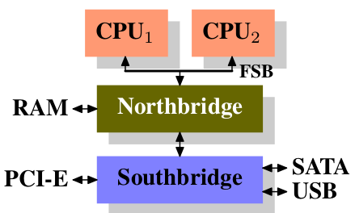
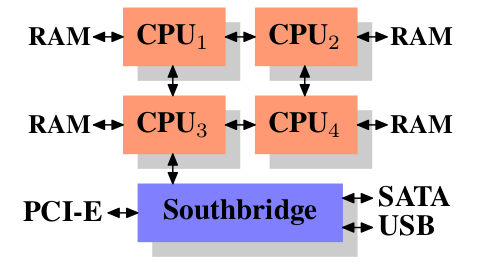
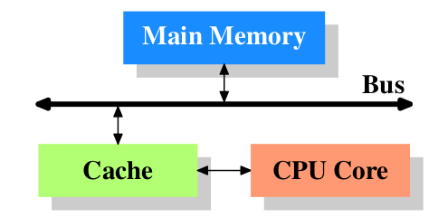
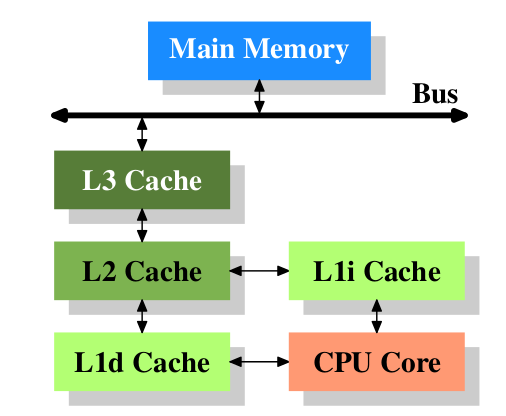
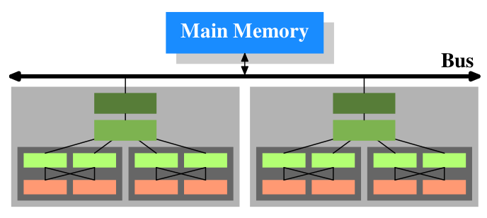

cpu cache

对内存性能的提高主要有:
    RAM hardware design (speed and parallelism).
    Memory controller designs.
    CPU caches.
    Direct memory access (DMA) for devices

对机器的使用偏向于使用小的机器，通过网络连接。而不是使用大的数据中心。

机器架构的演化：

多个 CPU 通过 FSB(the Front Side Bus) 连接到北桥，北桥处理内存。北桥与南桥相连接，南桥处理所有的 I/O

CPU 之间的通信也要经过北桥

DMA 直接在北桥的帮助下读写 RAM， 不用通过 CPU，提高了性能。

没有 FSB 和北桥，CPU 直接与内存通信。CPU 之间直接通信。

内存对所有的 CPU 都是可访问的。当 CPU1 访问 CPU2 的内存时，要产生额外的通信。

CPU 的频率大约是内存频率的 11 倍或更多。

CPU cache

图中的 Bus 就是 FSB

cache 使用提前载入的方式来提高性能。

cache 分为数据 cache 和代码 cache

图中的 L1i 为代码一级 cache, L1d 为数据一级 cache

两个 CPU，每个 CPU 两个 core, 每个 core 两个 thread。thread 共享一级 cache， core 共享2级 cache

所有的内存地址都是可以被 cache 的。每个 cache entry 都对缓冲的地址进行了 tag。当访问内存地址时，首先在cache中查找 tag。

由于tag额外增加了数据，所以按行(64位系统一行为64字节)为单位对内存地址进行 cache。 当访问一个地址时，整个 cache line 被载入一级cache。

tlb cache: 虚拟地址转化为物理地址的 cache

当数据跨页时，tlb cache 要重新计算，性能下降

两类特殊地址
 write-combining: 如显存
 uncacheable: 如一些实时的 LED 灯的地址

 多线程，当超出 cache，访问 Ram 时通过同一个 Bus，会发生性能下降
