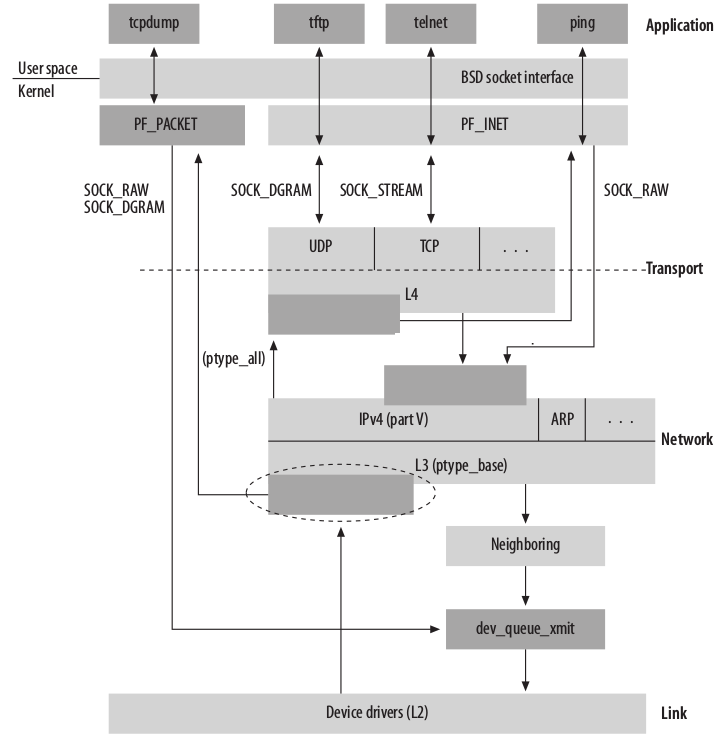
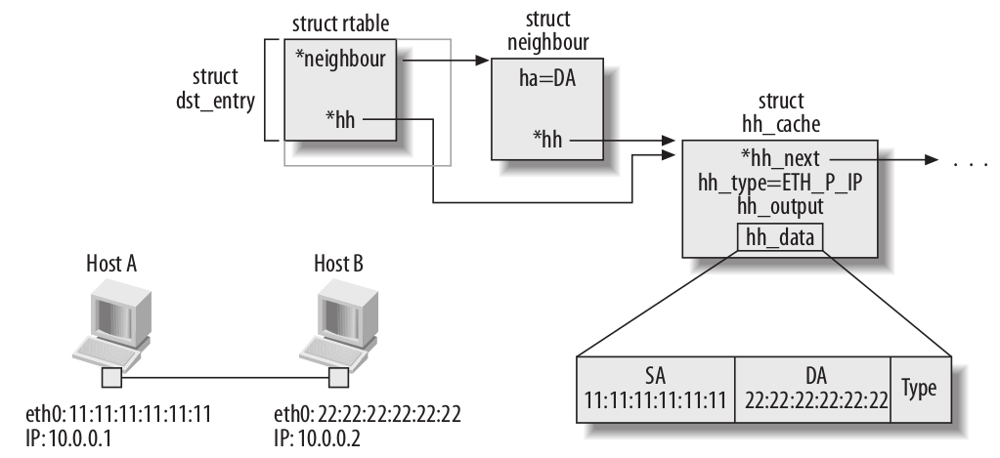

# linux network

## 分层

- L2 : 链路层, Ethernet(以太网)
- L3 : 网络层, network, ip
- L4 : 传输层, transport, tcp


## 数据结构

### 包内容


头节点为 sk_buff_head, 双向列表，每个节点都指向头, qlen 为节点数目


sk 指向此包对应的 socket, 此时包由本地产生或被本机接收。当此包为 forward， sk 为空


当数据包从一个层传递到另一个层，对应的指针进行变换，不会发生数据的移动。

### 网卡设备

```c
struct net_device
```

所有的网络设备挂在一全局列表下面，由 dev_base 指向此列表


#### 标识

- ifindex 唯一标识
- iflink 虚拟设备用来指明实际设备

#### 配置

- name 设备名 (eth0)
- irq 中断号
- dma DMA 通道
- flags 设备状态 IFF_UP(设备使能)
- mtu MTU
- type 设备类型 (Ethernet)
- broadcast 链路层广播地址
- dev_addr 网卡地址
- promiscuity Promiscuous mode，设备接收所有经过的数据包，而不是只接收地址与设备相同的数据包

#### 统计数据

- priv 指向统计数据，不同的设备有不同的数据结构

#### 设备状态

- state 在网络队列子系统中使用的一系列标识
- reg_state 设备的注册状态
- trans_start 发送一个 frame 开始时设置此时间
- last_rx 一个包被接收时设备此时间
- master 当一组设备被组织成一个组时，会指定一个为 master
- atalk_ptr ip_ptr dn_ptr ip6_ptr ec_ptr ax25_ptr 指向不同协议的数据

#### 多播

- mc_list 指向设备要侦听的多播地址列表的头节点
- mc_count 多播地址个数， mc_list 的长度
- allmulti 不为０，侦听所有多播地址( promiscuity )

#### 流量管理

- qdisc qdisc_sleeping qdisc_ingress qdisc_list 发送的接收队列
- tx_queue_len 发送队列长度

## Notification Chains

只用于内核子系统间的消息传递。

一个函数列表，当事件发生，函数被依次调用。

一个模块可定义一个 Notification Chains, 其它模块可以向其注册，以便事件发生时得到通知。

网络模块的 Notification Chains

- inetaddr_chain IP地址变化时
- netdev_chain  网卡状态变化时

## 数据传输




协议的组织


ip层


## 从设备读入数据

### polling

内核不停检测网卡是否有数据可读。

### 中断

当有事件发生，设备产生一个中断。在高负载的情况下，频繁产生中断，内核会花大量时间在处理中断请求上面。

### NAPI

低负载时使用中断，高负载时使用 polling

## 发送数据


## 接收数据


## 路径


1. 数据一直到设备发送
2. 设备在 lock 状态，此时触发 Tx 软中断。此中断例程在稍后发送设备发送队列中的数据。
3. 穿过 tcp 层，但因为 QOS　策略不能继续传输。原因可能是有进程在处理队列，或队列已满。后种情况将启动一个定时器，稍后处理队列。
4. 穿过 tcp 层，但因为 tcp 状态或阻塞算法不能继续传输。根据 tcp event 稍后处理队列。
5. 在中断上下文中进行，处理 2 的队列。
6. 在中断上下文中进行，处理 4 的队列。

## bridge

repeater(hub), bridge, route


- repeater 设备层，按位拷贝
- bridge 链路层，按frame拷贝
- route 网络层，按package拷贝

## route

路由子系统在网络堆栈中的位置


### 路由器


Default GW 为路由器，有多个网卡，运行路由协议，数据从一个网卡发送到另一个网卡。

### 路由表

所有的主机都有路由表，而不仅仅只有路由器才有路由表。

路由表是一个数据库，称为 Forwarding Information Base (FIB)

linux 内核有两个路由表

- 本机地址路由表，如果在此表中查找成功，包提交到本机
- 其它路由的路由表。由用户配置或由路由协议动态添加

### 路由 cache

有两个 cache

- 协议相关 cache
- 协议无关 cache ( DST )

### 接收和发送


### 路由配置

- 不同的网卡设置的子网。每个子网连接不同的网络。
- 不同的网卡设置的子网。每个子网在同一个网络。
- 在每个子网都配置了一个地址，但这些地址被配置在同一个网卡上。

### 非路由地址

| Addresses | 数量 | Class
| - | - | -
| 10.0.0.0/8 | 1 | Class A
| 172.16.0.0/16 to 172.31.0.0/16 | 16 | Class B
| 192.168.0.0/16 | 256 | Class C
| 127.0.0.0/8 (Loopback) | 1 | Class A

这些地址一般用在局域网中。不能使用这些地址作为互联网服务。互联网路由不支持以上地址。

这些地址通过　Network Address Translation (NAT)　与互联网相连接。

可以在互联网中路由的地址由　Internet Service Provider (ISP)　提供，保证全球唯一。


### 作用域 (Scope)

目标地址到本机地址的距离。

- Host 本机
- Link 局域网
- Universe 任何地方( 默认 )

IP地址是属于主机的，并不是属于网卡。虽然其是配置在网卡上的。

### 默认网关

0.0.0.0/0

一个主机中的路由表项一般有两项

- 本机地址，由网卡配置
- 默认网关，指向ISP分配的路由器

### 直接广播( Directed Broadcasts )

一个 broadcast 包就是一个发送到子网广播地址的包。由子网内部的主机产生。

Directed Broadcasts, 就是向远程子网的广播地址发送包。错误使用会产生 Denial of Service (DoS) 攻击。

### 多地址

一个网卡可以设置多个IP地址,同一个子网中第一个设置的为 primary 地址，后面的都为 secondary 地址。

```bash
ip a add 10.0.0.1/24 broadcast 10.0.0.255 dev eth0  # primary
ip a add 10.0.0.2/24 broadcast 10.0.0.255 dev eth0  # secondary
ip a add 10.0.0.3/24 broadcast 10.0.0.255 dev eth0  # secondary
ip a add 10.0.0.4/25 broadcast 10.0.0.127 dev eth0  # primary

ip address list dev eth0

inet 10.0.0.1/24 brd 10.0.0.255 scope global eth0
inet 10.0.0.2/24 brd 10.0.0.255 scope global secondary eth0
inet 10.0.0.3/24 brd 10.0.0.255 scope global secondary eth0
inet 10.0.0.4/25 brd 10.0.0.127 scope global eth0
```

### 策略路由 ( Policy Routing )

当内核支持策略路由，可以有 255 个独立的路由表。

通过策略路由，用户可以通过多个参数配置路由，而不是仅仅通过目标地址。


| 接收网卡 | 源地址 | 目标址 | Next hop | 发送网卡
| - | - | - | - | -
| eth0 | - | 10.0.3.0/24 | 10.0.0.10(RT1) | eth2
| eth0 | - | 10.0.2.0/24 | - | eth1
| eth1 | - | 10.0.3.0/24 | 10.0.0.20(RT2) | eth2
| eth1 | - | 10.0.1.0/24 | - | eth0
| eth0 | - | 0.0.0.0/0 | 10.0.0.11(DG1) | eth2
| eth1 | - | 0.0.0.0/0 | 10.0.0.21(DG2) | eth2

- 从 eth0 进来的选择 RTable1
- 从 eth1 进来的选择 RTable2

RTable1

| 目标址 | Next hop | 发送网卡
| - | - | -
| 10.0.3.0/24 | 10.0.0.10(RT1) | eth2
| 10.0.2.0/24 | - | eth1
| 0.0.0.0/0 | 10.0.0.11(DG1) | eth2

RTable2

| 目标址 | Next hop | 发送网卡
| - | - | -
| 10.0.3.0/24 | 10.0.0.20(RT2) | eth2
| 10.0.1.0/24 | - | eth0
| 0.0.0.0/0 | 10.0.0.21(DG2) | eth2

#### 路由表选择参数

- 源地址，目标地址
- 接收网卡
- TOS
- Fwmark 防火墙设置

### 多路径路由( Multipath Routing )

```bash
ip route add default scope global nexthop via 100.100.100.1 weight 1 nexthop via 200.
200.200.1 weight 2
```

一个路由设置多个 next hop. 如何选择由算法决定。

#### weighted round-robin 算法

如果两个 next hop 的　weight 为３和５。一种算法是先选择第一个３次，再选择第二个５次，然后循环。这样会造成拥塞。

linux 加了一个随机量。

- 定义 total 为所有 next hop 的 weight 的和
- 然后每个 netxt hop 的 budget 初始值设为它们的 weight, wi
- 产生 0 - total 的一个随机数 r
- 遍历 next hop 列表，如果 wi >= r，则选择此 next hop
- 否则 r -= wi，继续直到找到

### 路由与其它系统


### 基于路由表的分类( Routing Table Based Classifier )

对 Traffic Control 系统进行分类的一种方法。

每个策略和路由可被设置两个realms

- ingress realm
- an egress realm

```bash
# 策略realms
ip rule add ... realms [source_realm/] destination_realm

ip rule add from 10.0.1.0/24 realms 128
ip rule add from 10.0.1.0/24 to 10.0.2.0/24 realms 64/128

# 路由realms
ip route add ... realms [source_realm/]destination_realm

ip route add 10.0.1.0/24 via 10.0.0.3 realms 100
ip route add 10.0.1.0/24 via 10.0.0.3 realms 100/200
```

如果没指定 realm 内核计算一个

## Neighboring( ARP )

在链路层上相连接的主机

解决 L2 与 L3 地址的关联( ip 地址和 mac 地址)


以太网多播地址可由 ip 地址直接计算得到，不需要通过 arp 进行对应


以太网广播地址为 FF:FF:FF:FF:FF:FF

### 模块关系( neighboring infrastructure )


### 代理

一个主机响应其它主机的 arp 响应，称作代理，可以将两个网络通过代理进行连接。

### NUD 状态

快速决定一个 mac 地址是否是可达的。对每个路径维护一个状态。

### 内核数据结构与路由和 cache 的关系

