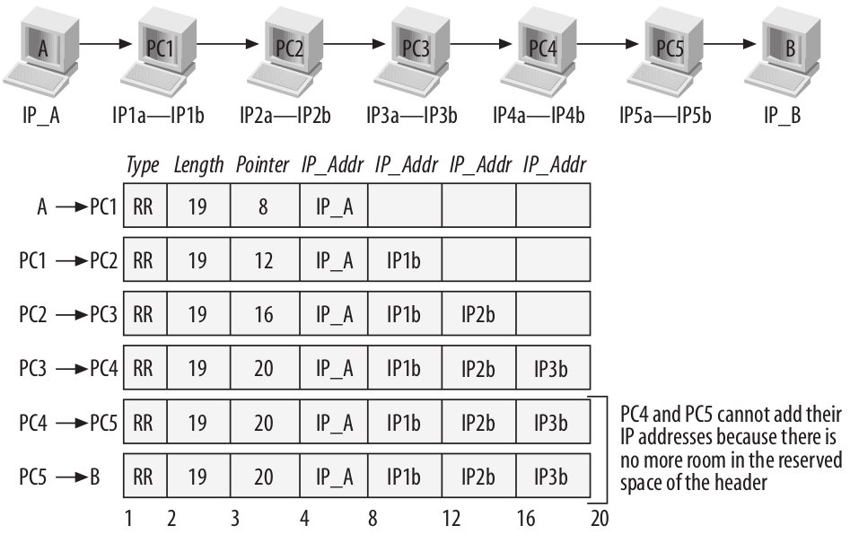
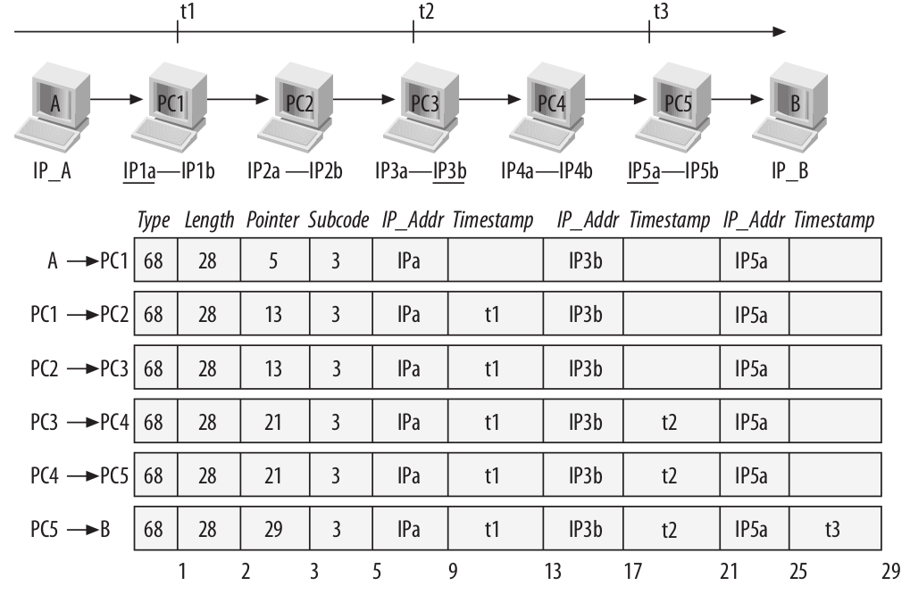

# IP

## Internet Header Format

```bash
    0                   1                   2                   3
    0 1 2 3 4 5 6 7 8 9 0 1 2 3 4 5 6 7 8 9 0 1 2 3 4 5 6 7 8 9 0 1
   +-+-+-+-+-+-+-+-+-+-+-+-+-+-+-+-+-+-+-+-+-+-+-+-+-+-+-+-+-+-+-+-+
   |Version|  IHL  |Type of Service|          Total Length         |
   +-+-+-+-+-+-+-+-+-+-+-+-+-+-+-+-+-+-+-+-+-+-+-+-+-+-+-+-+-+-+-+-+
   |         Identification        |Flags|      Fragment Offset    |
   +-+-+-+-+-+-+-+-+-+-+-+-+-+-+-+-+-+-+-+-+-+-+-+-+-+-+-+-+-+-+-+-+
   |  Time to Live |    Protocol   |         Header Checksum       |
   +-+-+-+-+-+-+-+-+-+-+-+-+-+-+-+-+-+-+-+-+-+-+-+-+-+-+-+-+-+-+-+-+
   |                       Source Address                          |
   +-+-+-+-+-+-+-+-+-+-+-+-+-+-+-+-+-+-+-+-+-+-+-+-+-+-+-+-+-+-+-+-+
   |                    Destination Address                        |
   +-+-+-+-+-+-+-+-+-+-+-+-+-+-+-+-+-+-+-+-+-+-+-+-+-+-+-+-+-+-+-+-+
   |                    Options                    |    Padding    |
   +-+-+-+-+-+-+-+-+-+-+-+-+-+-+-+-+-+-+-+-+-+-+-+-+-+-+-+-+-+-+-+-+
```

### Version

4 bits

### IHL

4 bits

IP头部长度，单位：32 bit. 最小头部长度为 5 (20 字节)

### Type of Service

8 bits

现用于拥塞控制

### Total Length

16 bits

总长度，包含头部和数据，单位：字节。 最大长度为：65,535字节。
  
所有主机必须接受 576 字节的数据包。512 字节数据加上 64 字节头部。最大头部长度为 60 字节。

### Identification

16 bits

发送方用来标识数据包，用在分片功能。

### Flags

3 bits

| Bit | 描述
| - | -
| 0 | reserved, must be zero
| 1 | (DF) 0 = May Fragment,  1 = Don't Fragment
| 2 | (MF) 0 = Last Fragment, 1 = More Fragments

```bash
 0   1   2
+---+---+---+
|   | D | M |
| 0 | F | F |
+---+---+---+
```

### Fragment Offset

13 bits

分片时，此分片在原数据包的位置。单位 8字节(64 bits)。偏移从0 开始。

### Time to Live

8 bits

### Protocol

8 bits

上层协议类型

### Header Checksum

16 bits

只计算头部，不包含用户数据。头部会改变，如 TTL ，所以会重新计算

### Source Address

32 bits

### Destination Address

32 bits

### Options

单字节属性

一个 option-type 字节, 一个 option-length 字节, 多个 option-data 字节

option-type octet is viewed as having 3 fields:

```bash
1 bit   copied flag,
2 bits  option class,
5 bits  option number.
```

copied flag 标志此选项是否 copy 到所有分片

```bash
0 = not copied
1 = copied
```

option classes:

```bash
0 = control
1 = 保留
2 = debugging and measurement
3 = 保留
```

| CLASS | NUMBER | LENGTH | DESCRIPTION
| - | - | - | -
| 0 | 0 | - | End of Option list. 只占用１字节，无长度
| 0 | 1 | - | No Operation. 只占用１字节，无长度
| 0 | 2 | 11 | Security.  Used to carry Security, Compartmentation, User Group (TCC), and Handling Restriction Codes compatible with DOD requirements.
| 0 | 3 | var. | Loose Source Routing.
| 0 | 9 | var. | Strict Source Routing.
| 0 | 7 | var. | Record Route.
| 0 | 8 | 4 | Stream ID.  Used to carry the stream identifier.
| 2 | 4 | var.| Internet Timestamp.

#### End of Option List

```bash
+--------+
|00000000|
+--------+
  Type=0
```

选项的结束标志。不代表IP头部的结束。是所有选项的结束，并不是每个选项的结束，当选项的结束与头部的结束不重合时使用。

可以被 copied, introduced, or deleted on fragmentation, or for any other reason.

#### No Operation

```bash
+--------+
|00000001|
+--------+
  Type=1
```

在选项之间使用，32 bit 对齐

可以被 copied, introduced, or deleted on fragmentation, or for any other reason.

#### Security

This option provides a way for hosts to send security, compartmentation, handling restrictions, and TCC (closed user group) parameters.  The format for this option is as follows:

```bash
+--------+--------+---//---+---//---+---//---+---//---+
|10000010|00001011|SSS  SSS|CCC  CCC|HHH  HHH|  TCC   |
+--------+--------+---//---+---//---+---//---+---//---+
  Type=130 Length=11
```

##### Security (S field)

16 bits

Specifies one of 16 levels of security (eight of which are reserved for future use).

```bash
00000000 00000000 - Unclassified
11110001 00110101 - Confidential
01111000 10011010 - EFTO
10111100 01001101 - MMMM
01011110 00100110 - PROG
10101111 00010011 - Restricted
11010111 10001000 - Secret
01101011 11000101 - Top Secret
00110101 11100010 - (Reserved for future use)
10011010 11110001 - (Reserved for future use)
01001101 01111000 - (Reserved for future use)
00100100 10111101 - (Reserved for future use)
00010011 01011110 - (Reserved for future use)
10001001 10101111 - (Reserved for future use)
11000100 11010110 - (Reserved for future use)
11100010 01101011 - (Reserved for future use)
```

##### Compartments (C field)

16 bits

An all zero value is used when the information transmitted is not compartmented.  Other values for the compartments field may be obtained from the Defense Intelligence Agency.

##### Handling Restrictions (H field)

16 bits

The values for the control and release markings are alphanumeric digraphs and are defined in the Defense Intelligence Agency Manual DIAM 65-19, "Standard Security Markings".

##### Transmission Control Code (TCC field)

24 bits

Provides a means to segregate traffic and define controlled communities of interest among subscribers. The TCC values are trigraphs, and are available from HQ DCA Code 530.

Must be copied on fragmentation.  This option appears at most once in a datagram.

#### Loose Source and Record Route (LSRR)

```bash
+--------+--------+--------+---------//--------+
|10000011| length | pointer|     route data    |
+--------+--------+--------+---------//--------+
   Type=131
```

发送方提供路由信息，并记录路由信息。

pointer 指明　route data 中下一个路由的位置

route data 包含一系列ip地址。如果 pointer 大于 length, 路由指向目标地址

如果目标地址到达，但是 pointer 小于 length, 下一个地址替换为目标地址。recorded route address 替换为刚使用的源地址，pointer 加 4

Must be copied on fragmentation.  Appears at most once in a datagram.



#### Strict Source and Record Route (SSRR)

```bash
+--------+--------+--------+---------//--------+
|10001001| length | pointer|     route data    |
+--------+--------+--------+---------//--------+
Type=137
```

必须按照指定的路由进行发送

Must be copied on fragmentation.  Appears at most once in a datagram.

#### Record Route

```bash
+--------+--------+--------+---------//--------+
|00000111| length | pointer|     route data    |
+--------+--------+--------+---------//--------+
Type=7
```

记录路由

选项大小不会增加。

Not copied on fragmentation, goes in first fragment only. Appears at most once in a datagram.

#### Stream Identifier

```bash
+--------+--------+--------+--------+
|10001000|00000010|    Stream ID    |
+--------+--------+--------+--------+
Type=136 Length=4
```

This option provides a way for the 16-bit SATNET stream identifier to be carried through networks that do not support the stream concept.

Must be copied on fragmentation.  Appears at most once in a datagram.

#### Internet Timestamp

```bash
+--------+--------+--------+--------+
|01000100| length | pointer|oflw|flg|
+--------+--------+--------+--------+
|         internet address          |
+--------+--------+--------+--------+
|             timestamp             |
+--------+--------+--------+--------+
|                 .                 |
                  .
                  .
Type = 68
```

最大长度 40

oflw [4 bits] 空间不够，溢出标志

flg [4 bits]

```bash
0 -- time stamps only, stored in consecutive 32-bit words,

1 -- each timestamp is preceded with internet address of the registering entity,

3 -- the internet address fields are prespecified.  An IP module only registers its timestamp if it matches its own address with the next specified internet address.
```

毫秒级

不能 copy 到分片



### Padding:  variable

使头部按 32 bit 边界对齐

## Addressing

| High Order Bits | Format | Class
| - | - | -
| 0 | 7 bits of net, 24 bits of host | a
| 10 | 14 bits of net, 16 bits of host | b
| 110 | 21 bits of net,  8 bits of host | c
| 111 | escape to extended addressing mode

A value of zero in the network field means this network.  This is only used in certain ICMP messages.  The extended addressing mode is undefined.
